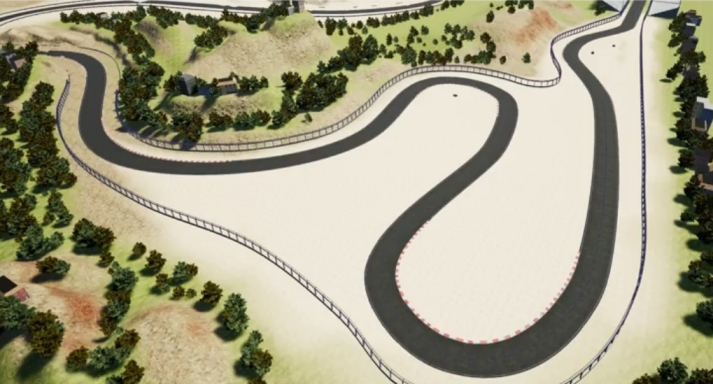

## Self Driving Cars Longitudinal and Lateral Control Design 

Python controller is used to drive a car autonomously around a track in Carla Simulator.



### Project notes:

The waypoints include positions as well as the speed the vehicle should attain. As a result, the waypoints
become the reference signal for our controller and navigating to all the waypoints effectively completes the full track.

Since the controller reference contains both position and speed, we need to implement both *Longitudinal and Lateral Control*.

The output of the controller will be the vehicle *throttle*, *brake* and *steering angle* commands.
The throttle and brake come from the Longitudinal speed control and the steering comes from our Lateral Control.


### How to run in  Ubuntu:

- __Server terminal:__
```
cd /path_to/CarlaSimulator      # where the CarlaSimulator is located

./CarlaUE4.sh /Game/Maps/RaceTrack -windowed -carla-server -ResX=640 -ResY=480 -benchmark -fps=20
```

- __Client terminal:__
```
cd /path_to/CarlaSimulator/PythonClient/vehicle_control

python3 module_7.py
```
**NOTE**: clone this repo within */path_to/CarlaSimulator/PythonClient* forlder
